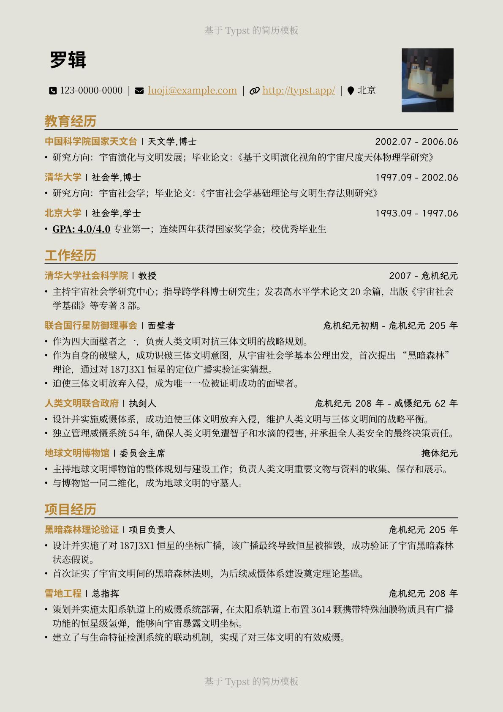
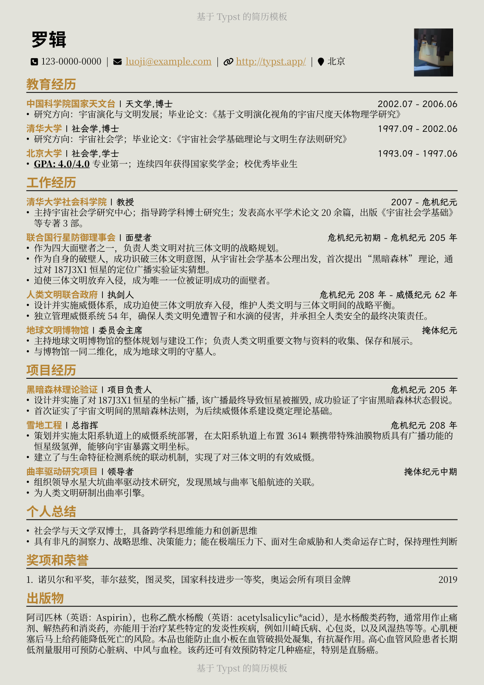

# Another Minimalistic Typst Resume Template

自己搓着玩的简历模板，在极简风格基础上添加了一些小功能，能灵活调整布局以将内容控制在刚好一页纸

## Features

1. 设计使用三种字体，一种无衬线字体用于突出强调的标题，两种无衬线字体用于不同的正文内容
2. 可更换主题色，制造差异化，见 `accent-color` 参数
3. 为了让内容保持在一页以内，设计了按倍数缩放的间距，见 `element-spaciness` 参数

## Demo

以下是一个示例，对不同体量的简历内容，可以调整布局间距，以让简历刚好占据一页纸。在 Typst 代码中，该功能通过同时调整页边距、行距、段间距实现。

---

宽松布局 `element-spaciness=1.6`

---

紧凑布局 `element-spaciness=0.85`

