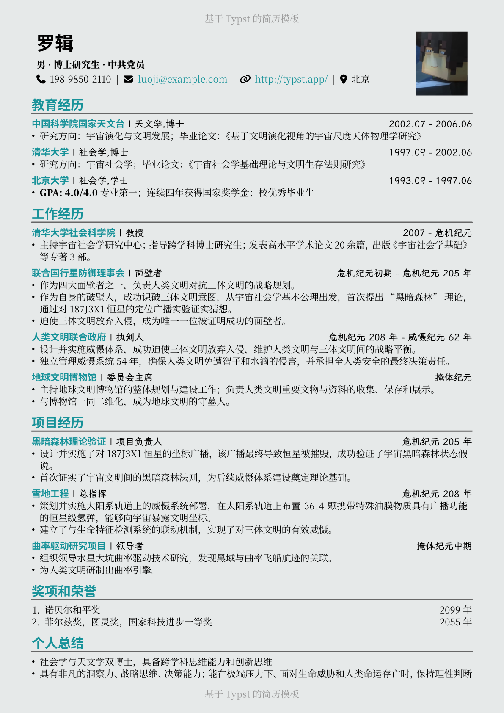
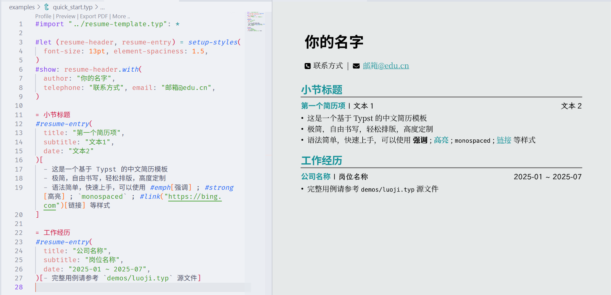

# Another Minimalistic Typst Resume Template

**A minimalistic resume template based on [Typst](https://typst.app/). Easy to use. Effortless typesetting. Highly customizable. Fit your content perfectly on one page by tuning just one parameter.**

基于 [Typst](https://typst.app/) 的中文简历模板。极简，易用，轻松排版，高度定制。能无痛排版让内容刚好填满一页。

## 效果展示



---

## 快速开始

使用本模板，你将通过编写 Typst 源文件来制作简历，借助 IDE 插件可以实时预览。编写文件只需要用到基本的标记语法，不需要编程语言基础。



1. 克隆本仓库，或者下载 [Release 包](https://github.com/habaneraa/typst-resume-one-page/releases)
   ```bash
   git clone https://github.com/habaneraa/typst-resume-one-page.git
   ```

2. 打开你喜欢的 IDE (例如 VSCode)，搜索并安装插件 [Tinymist](https://github.com/Myriad-Dreamin/tinymist)

3. 编辑示例文件 `examples/luoji.typ` 或 `examples/quick_start.typ`，编写你的简历内容

4. 在文件起始处点击 "Preview"，借助 Tinymist 可以实时查看效果

5. 排版：通过调整 `font-size`、`element-spaciness` 等参数，使得内容刚好填充一页；也可以通过 `accent-color`、`serif-font` 等参数自定义样式，彰显个性。

6. 点击 "Export PDF" 导出 PDF 格式简历（Tinymist 功能）。或者使用 `typst compile` 命令行工具进行编译。

## 使用指南

第一步，在你的 Typst 源文件里导入模板，并初始化样式：

```typst
#import "resume-template.typ": setup-styles
#let (resume-header, resume-entry) = setup-styles(
  font-size: 11pt,
)
```

样式设置：

- `accent-color`：主颜色，如不需要可以设置为黑色 `rgb("#000000")`
- `background-color`：背景色，默认是浅灰色 `rgb("#e6e9e9")`
- `sans-serif-font`：用作正文文本的无衬线字体，默认是 Source Han Sans SC
- `serif-font`：用作标题的衬线字体，默认是 Source Han Serif SC
- `alt-serif-font`：第二种衬线字体，用于副标题，默认是 LXGW WenKai GB Screen
- `font-size`：字体大小推荐 10pt 到 12pt，默认值是 11pt
- `element-spaciness`：元素距离乘数，会同时影响页边距和行距，用于调整排版，可以尝试在 0.9 到 1.5 之间进行调整
- `separator`：用于分隔不同信息的符号，默认是竖线

第二步，使用 `resume-header` 填写基本信息，这里除了 `author` 外的信息都是可选的。

```typst
#show: resume-header.with(
  author: "你的名字",
  profile-image: "/image.png", // 头像图片路径
  telephone: "",               // 电话号码
  email: "",                   // 邮箱地址
  github-id: "",               // GitHub 用户名，会自动生成主页链接
  other-link: "",              // 填写 URL，会自动生成链接
  location: "",                // 位置，例如 [北京-海淀区]
  extra-infos: (),             // 可以按列表形式填写其他信息
)
```

第三步，编写正文。

使用 `= 标题` 来创建最显眼的一级标题，通常为 “教育经历”，“项目经历”，“技能”，“荣誉奖项” 等。

使用 `resume-entry` 来添加简历条目，条目标题会被高亮显示，其余参数都会显示在一行内，正文可以使用任何 Typst 语法，推荐使用无序列表编写条目内容正文。

```typst
#resume-entry(
  title: "学校名称 / 公司名称 / 项目名称",
  subtitle: "学位 / 职位 / 项目角色",
  date: "2023.09 ~ 2025.06",
)[
  - 条目描述
]
```

如果不希望使用 `resume-entry` 提供的样式，可以直接编写正文，这通常用于不需要段落区分的小节，例如 “个人总结” 或 “技能”。

*One More Thing*: 现代 IDE 里面的 coding agent 只需要引用到两个 typ 文件即可获取全部上下文，你完全可以使用 Copilot/Cursor/ClaudeCode 等工具帮助你调整内容、润色文本、修改样式。

<p align="center">最后祝你求职顺利🥰~ </p>
